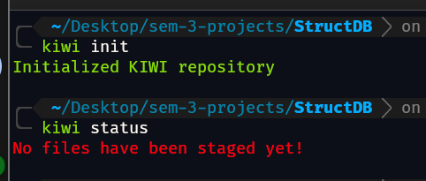
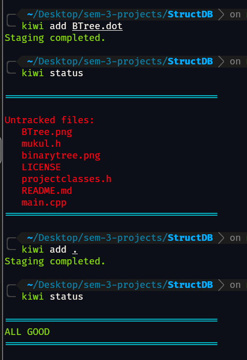
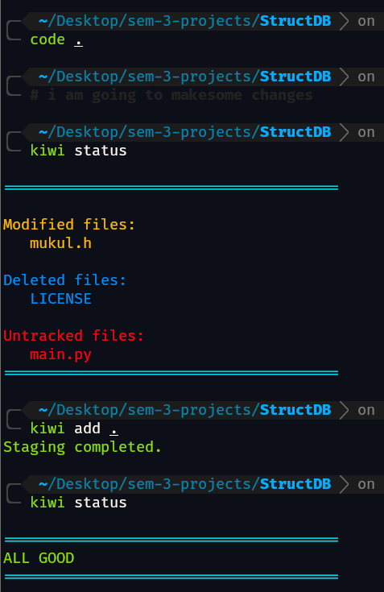
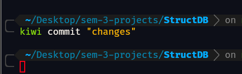
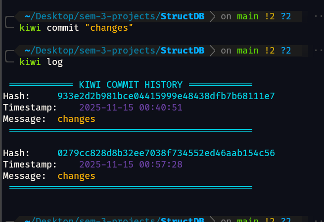

<p align="center">
  
</p>

# 🥝 KIWI — A Minimal & Colorful Version Control System

**KIWI** is a custom-built **Version Control System (VCS)** that aims to provide a **cleaner, more colorful, and interactive** command-line experience.  
It’s lightweight, easy to use, and perfect for understanding how VCS tools like Git work under the hood — without all the clutter!

---

##  Features
- **Colorful Output** — Easy-to-read terminal interface with styled logs and commit history  
- **Lightweight Design** — No dependencies, built purely in Java  

- **Educational** — Ideal for learning VCS fundamentals like staging, committing, and logging  

- **Cross-Platform** — Works seamlessly on **Windows**, **Linux**, and **macOS**  

---

## Setup Instructions

###  **For Linux**
```bash
git clone https://github.com/me-is-mukul/KIWI.git
cd KIWI
javac -d . src/*.java errors/*.java utils/*.java
chmod +x kiwi
if [ -n "$ZSH_VERSION" ]; then
  echo "export PATH=\$PATH:$(pwd)" >> ~/.zshrc
  source ~/.zshrc
else
  echo "export PATH=\$PATH:$(pwd)" >> ~/.bashrc
  source ~/.bashrc
fi
```

###  **For Windows**
```bash
git clone https://github.com/me-is-mukul/KIWI.git
cd KIWI
javac -d . src/*.java errors/*.java utils/*.java
setx PATH "%PATH%;%cd%"
```

## USAGE SCREENSHOTS

### Initialising and Status
<p align="left">
  
</p>

### Add before modi-fication
<p align="left">
  
</p>

### Add after modi-fication
<p align="left">
  
</p>

### Commit
<p align="left">
  
</p>

### LOGS
<p align="left">
  
</p>

### Collaborator 
GitHub: @SaraJain90